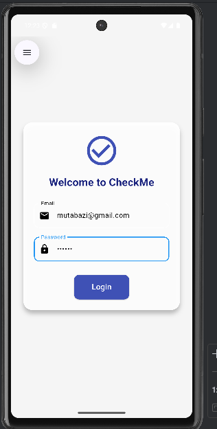
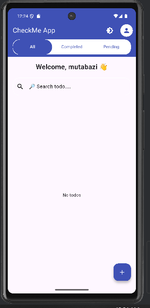
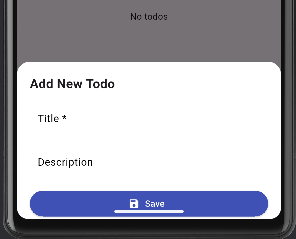
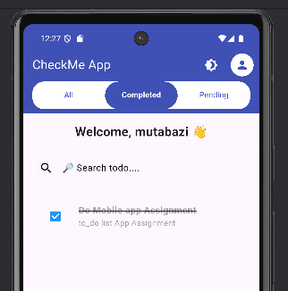
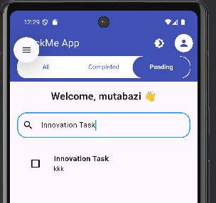
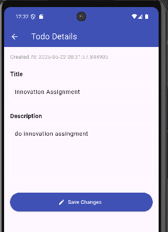
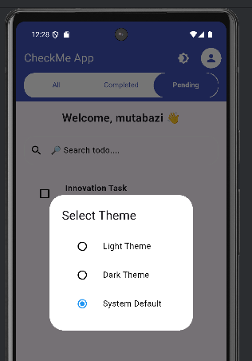
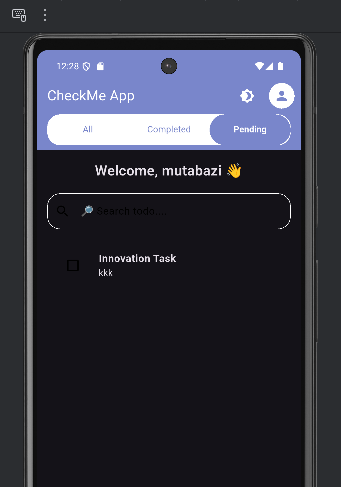

# 📝 Flutter To-Do List App

A To-Do List application built with Flutter. This app helps you manage daily tasks efficiently with features like task categorization, login authentication, search functionality, and task updates.

---

## 🚀 Features

- ✅ **Login Screen** to start the app.
- 🗂️ **Navigation Buttons** to filter tasks:
  - **All**
  - **Completed**
  - **Pending**
- ➕ **Add New Task** using the **Add button**.
- 🔍 **Search** tasks by name.
- 🔁 **Update Task** by **long-pressing** on a task.
- ❌ **Delete Task** by **swiping left** on a task.

---

## 📱 Screenshots

| Login Screen | Task View (All) | Add Task | | Completed Task | | Pending Task |
|--------------|-----------------|----------|
|  |  |  |  |  |


| Search Task | Update Task | Delete Task | | light/Dark theme |
|-------------|-------------|--------------|
|  |  |  |  |  |


📦 Dependencies Used

flutter_riverpod

shared_preferences

cupertino_icons


---

## 🛠️ How to Run

1. **Clone the project:**
   ```bash
   git clone https://github.com/kskalisa/assignment-todo-app
   cd flutter-todo-app

